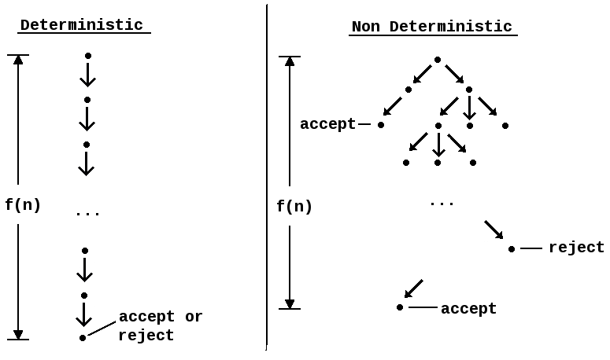

@title[Introduction]

## Intermittent Test Failures
#### Pramod Jacob

---

@title[Source]

### Source

- This presentation is based on a talk given by **Tim Mertens** of **Avant** at **RubyConf 2017**

---

@title[Deterministic Behavior]

### Deterministic Behavior

- Deterministic code always produces the same output for a given input
- In contrast, non-deterministic code produces random, unexpected output for a given input, possibly caused by:
  - Race conditions
  - Unexpected state
  - Changing state

---

---

### Non-Determinism and Tests

- Non-deterministic behavior causes intermittent test failures
- "Flaky tests are a myth." - Tim Mertens
- **Our goal is to build tests that defend against non-deterministic behavior**

---

## ???

---

## No.

---

### Finding Non-Deterministic Tests
...that are reproducible

---?code=code/test_rerun.rb&lang=ruby&title=Multiple Test Runs

---

### Causes for Non-Deterministic, __Reproducible__ Failures

---

### 1) Data Pollution

- Tests should always clean up after themselves, through before actions, etc.
- Be aware of both planned and unplanned dependencies

---?code=code/feature_toggle.rb&lang=ruby

@[1-2,4-13](This broke)
@[3](Line added to resolve dependency issues)
@[1-13](This works)

---

### 1) Data Pollution

- Make sure transactional fixtures are disabled in rails

---?code=code/trans_fix.rb&lang=ruby

Try not to do this

---

### 2) Vague Assertions

- Never expect the return value of an ActiveRecord query to return in some assumed order

---?code=code/user_test_bad.rb&lang=ruby

---?code=code/user_test_good.rb&lang=ruby

@[5](Check the count)
@[6-7](Check for included values)
@[8](Check for excluded values)

---

### 2) Vague Assertions

- Don't expect tables to be empty - check for __relative__ change

---?code=code/assertion_bad.rb&lang=ruby

---?code=code/assertion_good.rb&lang=ruby

---

### 3) Randomized Test Data

- Don't randomize your test data
- Don't use Faker, which ight return strings in a format that code doesn't handle properly
  - Names: D'Angelo, Doe-Smith, Smith Jennings
  - Phone numbers in different formats
- If you do need to randomize data, output it with test error messages to make debugging easier

---

### 4) Mutated Constants

- Don't overwrite constants - they can be mutated between tests
- RSpec has a `stub_const` method for stubbing constants
- Unfortunately, MiniTest doesn't have a built-in method for stubbing constants when needed

---?code=code/minitest_stub_const.rb&lang=ruby

[Source: minitest-stub-const docs](https://github.com/adammck/minitest-stub-const)

---

### 4) Mutated Constants

- In tests, set constants using `let` variables
- Constants defined directly within tests often aren't restricted to the scope in which they're defined
- Setting multiple constants with the same name can result in a race condition

---?code=code/test_const_bad.rb&lang=ruby

---?code=code/test_const_good.rb&lang=ruby